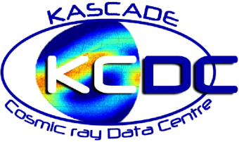

# README 

## About

This repository is a part of the [KCDC open access tutorial for the Hacky Hours at DPG=2023](https://www.dpg-verhandlungen.de/year/2023/conference/smuk/part/akjdpg/session/2). Here you can find a template for a simple data-based web application you can use to make the results of your analysis more accessible for your audience. This repository is based on the [KG-ML web application](https://kascade-streamlit.labs.jb.gg/), developed in the framework of the [KCDC](https://kcdc.iap.kit.edu/) Outreach activities. More about this one can find in our [publication](https://pos.sissa.it/410/007/pdf) or in [our app code repository](https://github.com/CantaTronic/kg_ml_app). 

For more inspiration, please take a look in [Streamlit Gallery](https://streamlit.io/gallery).

## Instruction

Run the template following the instruction below. Study and update the code in the `app.py` with some code you've worked with during the second part of the tutorial session.
Enjoy!

## How to run the app:

### a) In Docker

* Build the image: `docker build --tag app:1.1 . `
* Choose the port number, for example, `5391`
* Run the app in the container: `docker run --publish 5391:5391 -it app:1.1`

Ready!

### b) In virtual environment

If you don't want to run the app in the container, you can 

* run virtual environment using `pipenv shell`
* Choose the port number, for example, `5391`
* run the app using `streamlit run app.py --server.port 5391`

## Prepared by
Victoria Tokareva for KCDC Team, 2023.
